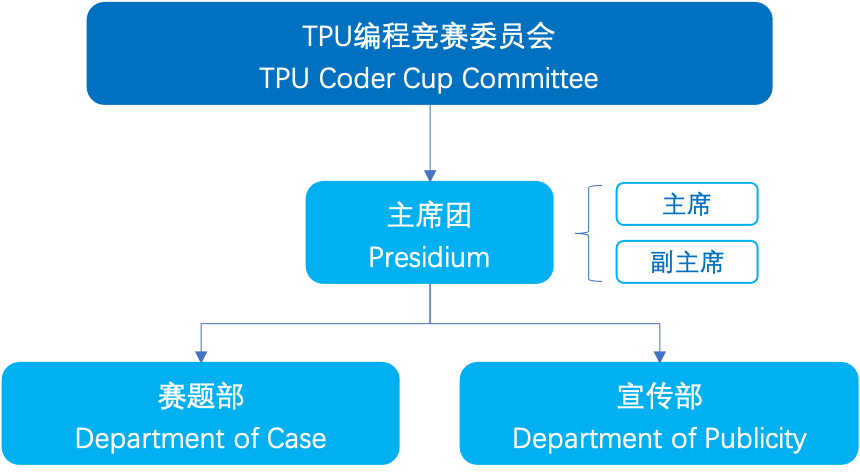

## TPU Coder Cup Committee Recruitment Notice 🥳

**TPU Coder Cup Committee** is committed to building and maintaining a high-level TPU competition platform. It consists of three departments: the **Presidium**, the **Case Department** and the **Publicity Department**. We are looking for enthusiastic individuals to join our **Case and Publicity Departments**! If you are **passionate** and excited about the opportunity to contribute to the success of our organization, you can send your profile via email at [weilin.pan@sophgo.com](weilin.pan@sophgo.com).

### Case Department 🔨

The **Case Department** is one of the core departments of the open-source competition committee. It is responsible for formulating competition topics, formats, and **managing** the competition operations. It is a gathering place for technical experts!

#### Main Responsibilities

1. **Draft competition task documents**, including topic introduction, data  description, competition process, award settings, evaluation criteria, etc.
2. **Manage** the competition **operations**. Responsible for answering questions and providing technical support to the competition community, drafting competition baselines, and reviewing and reproducing participants' submissions.
   **Requirements**:
    - **Passionate** about **TPU programming** competitions, **strong** computer technical skills.
    - **Strong** sense of **responsibility**, good **teamwork** spirit, and **communication** skills.

### Publicity Department 📢

The **Publicity Department** is dedicated to building a more international image for the TPU programming competition. It is responsible for **event promotion** and **design matters**. 

#### Main Responsibilities

1. **Promote** the competition events.
2. **Plan** and **organize** activities.
3. **Graphic design**.
   Requirements:
    - **Proficiency** in using **Photoshop** and **video editing** software is preferred.
    - **Possess** a high **market sensitivity** and able to **explore** potential cooperation opportunities.
    - **Strong execution** ability, good **teamwork** spirit, and **communication skills**.

